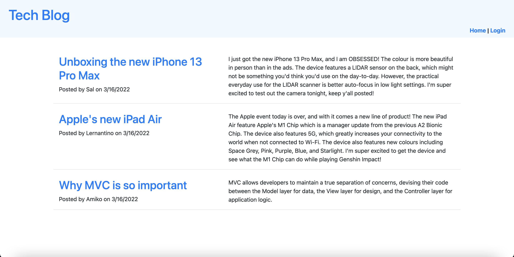
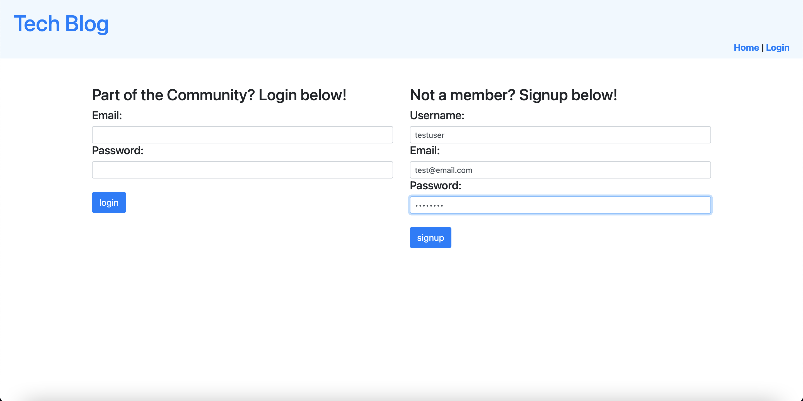
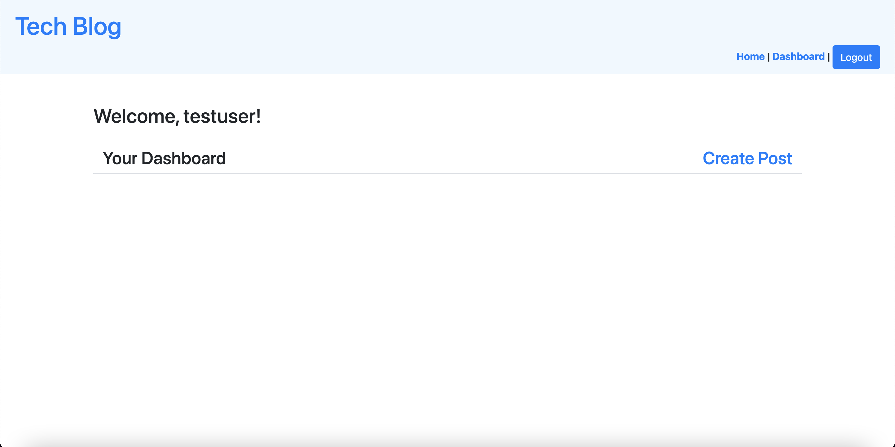

# Tech-Blog

## Table of Contents
* [Description](#desc)  
* [Installation](#install)  
* [Usage](#usage)  
* [Credits](#credits)  
* [License](#license)  
* [Github](#github)  

## Description

Writing about tech can be just as important as making it. Developers spend plenty of time creating new applications and debugging existing codebases, but most developers also spend at least some of their time reading and writing about technical concepts, recent advancements, and new technologies. A simple Google search for any concept covered in this course returns thousands of think pieces and tutorials from developers of all skill levels!

The purpose of this project was to build a CMS-style blog site similar to a Wordpress site, where developers can publish their blog posts and comments on other developers' posts as well. The site was built completely from scratch, and it deployed on Heroku. The application follows the MVC paradigm in its architectural structure, using Handlebars.js as the templating language, Sequelize as the ORM, and the express-session npm package for authentication.

## Installation
Follow the link in the GitHub section below to the deployed application on Heroku.
 
 
## Usage
The following image shows the application's appearance and functionality.

The application should appear as follows after loading:

The application should appear as follows on the Login page:

The application should appear as follows after successfully creating an account:

 
## Credits
Uoft SCS Coding Bootcamp Gitlab

 
## License
Copyright [2022] [Sevag Gaprielian]

Licensed under the Apache License, Version 2.0 (the "License"); you may not use this file except in compliance with the License.
You may obtain a copy of the License at http://www.apache.org/licenses/LICENSE-2.0.

Unless required by applicable law or agreed to in writing, software
distributed under the License is distributed on an "AS IS" BASIS,
WITHOUT WARRANTIES OR CONDITIONS OF ANY KIND, either express or implied.
See the License for the specific language governing permissions and
limitations under the License.

 
## GitHub
Github: sevaggap  
Deployed Application on Heroku: 